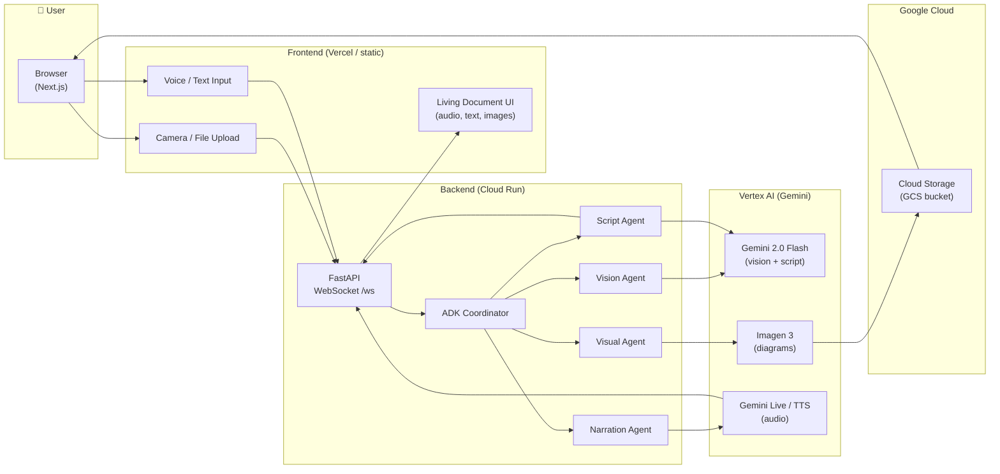

# The Living Textbook

**Point your camera at any homework problem. Ask a question. Get a real-time narrated explainer with AI-generated diagrams.**

Built for the [Gemini Live Agent Challenge](https://geminilivechallenge.devpost.com/) — Creative Storyteller category.

---

## What It Does

1. **Capture** — Take a photo of a textbook page, diagram, or homework problem using your camera or by uploading an image.
2. **Ask** — Type or speak your question (e.g. _"Explain how photosynthesis works"_).
3. **Experience** — A living document builds in real time:
   - An AI narrator speaks the explainer aloud (Gemini Live API)
   - Text narration appears word by word (typewriter effect)
   - AI-generated educational diagrams fade in alongside each section (Imagen 3)

This is not a chatbot. It is a streaming, multimodal experience that eliminates the text box entirely.

---

## Architecture

**System architecture diagram** — how the frontend, backend (Cloud Run), Vertex AI (Gemini), and Cloud Storage connect:



**Data flow:** Frontend sends photo + question over WebSocket to the backend on **Cloud Run**. The backend calls **Vertex AI** (Gemini Flash for vision/script, Imagen 3 for images, Gemini Live/TTS for audio) and **Cloud Storage** for image URLs, then streams audio, text, and image URLs back to the browser.

**Pipeline (text view):**

```
Browser (Next.js)
├── Camera / File Upload ──────────────────────┐
└── Voice / Text Question ─────────────────────┤
                                               ↓
                               FastAPI WebSocket (Cloud Run)
                                               │
                                   ADK Coordinator Agent
                                    ├── Vision Agent
                                    │     └── Gemini 2.0 Flash (analyzes photo)
                                    ├── Script Agent
                                    │     └── Gemini 2.0 Flash (structures explainer)
                                    └── In Parallel:
                                         ├── Visual Asset Agent
                                         │     └── Imagen 3 → Cloud Storage → Signed URL
                                         └── Narration Agent
                                               └── Gemini Live API (audio stream)
                                               ↓
                               Streamed back to browser:
                                ├── Audio PCM chunks (plays in real time)
                                ├── Text transcript (typewriter display)
                                └── Image URLs (fade-in inline diagrams)
```

---

## Tech Stack

| Layer | Technology |
|---|---|
| Frontend | Next.js 14 (App Router), TypeScript, Tailwind CSS, shadcn/ui |
| Audio capture | Web Audio API + AudioWorklet (16-bit PCM, 16kHz) |
| Backend | Python 3.11, FastAPI, WebSocket |
| Agent orchestration | Google ADK (multi-agent pipeline) |
| Vision + Script | Gemini 2.0 Flash (`gemini-2.0-flash-001`) |
| Live narration | Gemini Live API (`gemini-2.0-flash-live-001`) |
| Image generation | Imagen 3 (`imagen-3.0-generate-002`) |
| Storage | Google Cloud Storage (signed URLs) |
| Deployment | Cloud Run (backend), Vertex AI |

---

## Local Development

### Prerequisites

- Python 3.11+
- Node.js 18+
- A Google Cloud project with billing enabled
- APIs enabled: Vertex AI, Cloud Storage
- A GCS bucket for generated images

### 1. Backend

Run from the **project root** (`gemini-live-agent-challenge/`):

```bash
cd backend
cp .env.example .env
# Edit .env with your GCP project, bucket name, and credentials path
pip3 install -r requirements.txt
python3 main.py
# Server starts at http://localhost:8080
```

### 2. Frontend

Run from the **project root** (`gemini-live-agent-challenge/`), in a separate terminal:

```bash
cd frontend
cp .env.local.example .env.local
# .env.local already points to ws://localhost:8080/ws
npm install
npm run dev
# App opens at http://localhost:3000
```

---

## Production Deployment (Google Cloud Run)

### One-command deploy

```bash
chmod +x deploy/deploy.sh
GCP_PROJECT=your-project-id GCS_BUCKET=your-bucket-name ./deploy/deploy.sh
```

This script:
1. Enables all required Cloud APIs
2. Creates the GCS bucket if it doesn't exist
3. Builds and pushes the Docker image via Cloud Build
4. Deploys the FastAPI backend to Cloud Run
5. Prints the live WebSocket URL to configure the frontend

### Cloud Run service account IAM (required for image generation)

For **image generation (Imagen 3)** and **GCS uploads** to work on the live site, the Cloud Run service account must have:

| Role | Purpose |
|------|--------|
| **Vertex AI User** (`roles/aiplatform.user`) | Call Imagen 3 to generate diagrams |
| **Storage Object Admin** (or **Object Creator** + **Object Viewer**) (`roles/storage.objectAdmin` or `roles/storage.objectCreator` + `roles/storage.objectViewer`) | Upload images to GCS and create URLs for the frontend |

Grant them (replace `SERVICE_ACCOUNT` and `PROJECT_ID` with your values):

```bash
gcloud projects add-iam-policy-binding PROJECT_ID \
  --member="serviceAccount:SERVICE_ACCOUNT" \
  --role="roles/aiplatform.user"

gcloud projects add-iam-policy-binding PROJECT_ID \
  --member="serviceAccount:SERVICE_ACCOUNT" \
  --role="roles/storage.objectAdmin"
```

If images work locally but not on the live site, check Cloud Run logs for `Imagen generation error` or `Signed URL failed` / `make_public failed`. Without **Vertex AI User**, Imagen calls return errors. Without storage permissions, uploads or URL generation fail. If signed URL generation fails on Cloud Run (e.g. missing key), the backend falls back to making the object public and returning its public URL — ensure the bucket allows that or grant the service account **Service Account Token Creator** on itself to use signed URLs instead.

### Verbatim narration (TTS) — local, manual deploy, and Vertex AI

**Local:** With `GEMINI_TTS_MODEL=gemini-2.5-flash-tts` in `backend/.env`, just run the backend as usual. Narration will use the TTS API.

```bash
cd backend
source .venv/bin/activate   # if you use a venv
python3 main.py
```

**Cloud Run (manual deploy):** If you deploy with your own `gcloud run deploy` command, include `GEMINI_TTS_MODEL=gemini-2.5-flash-tts` in `--set-env-vars`. Example (add it to the comma-separated list):

```bash
gcloud run deploy living-textbook-api \
  --image=us-central1-docker.pkg.dev/windy-shoreline-488719-s2/cloud-run-source-deploy/living-textbook-api:latest \
  --platform=managed --region=us-central1 --project=windy-shoreline-488719-s2 \
  --set-env-vars="GOOGLE_CLOUD_PROJECT=windy-shoreline-488719-s2,GOOGLE_CLOUD_LOCATION=us-central1,GCS_BUCKET_NAME=gemini_live_agent_challenge,GEMINI_TTS_MODEL=gemini-2.5-flash-tts,..."
```

Or update the existing env vars on the running service without redeploying the image:

```bash
gcloud run services update living-textbook-api \
  --region=us-central1 \
  --project=windy-shoreline-488719-s2 \
  --set-env-vars="GOOGLE_CLOUD_PROJECT=windy-shoreline-488719-s2,GOOGLE_CLOUD_LOCATION=us-central1,GCS_BUCKET_NAME=gemini_live_agent_challenge,GEMINI_TTS_MODEL=gemini-2.5-flash-tts,GEMINI_LIVE_MODEL=gemini-2.0-flash-live-preview-04-09,GEMINI_FLASH_MODEL=gemini-2.0-flash-001,IMAGEN_MODEL=imagen-3.0-generate-002"
```

**Vertex AI — enable the TTS model:** The Gemini 2.5 Flash TTS model must be available in your project.

1. Open [Vertex AI Studio](https://console.cloud.google.com/vertex-ai/studio/overview?project=windy-shoreline-488719-s2).
2. Ensure the **Vertex AI API** is enabled: [Enable Vertex AI API](https://console.cloud.google.com/apis/library/aiplatform.googleapis.com?project=windy-shoreline-488719-s2).
3. In Vertex AI Studio, try **Language** or **Generate speech** (or check the model list). If `gemini-2.5-flash-tts` appears and you can use it, the model is enabled.
4. If you get “model not found” or 404 when running the app, check [Vertex AI model availability](https://cloud.google.com/vertex-ai/generative-ai/docs/available-models) for your region (`us-central1`) and enable any required “Generative AI” or “Speech” APIs listed there.

### CI/CD via Cloud Build

`deploy/cloudbuild.yaml` defines an automated pipeline. Connect it to your GitHub repository in the GCP Console under **Cloud Build → Triggers** and it will deploy on every push to `main`.

### Frontend deployment

After running `deploy.sh`, the script builds the frontend with the correct WebSocket URL. Deploy the frontend to Vercel, Firebase Hosting, or Cloud Run:

```bash
cd frontend
NEXT_PUBLIC_WS_URL=wss://your-cloud-run-url/ws npm run build
```

---

## Environment Variables

### Backend (`backend/.env`)

| Variable | Description |
|---|---|
| `GOOGLE_CLOUD_PROJECT` | Your GCP project ID |
| `GOOGLE_CLOUD_LOCATION` | Region (default: `us-central1`) |
| `GCS_BUCKET_NAME` | Cloud Storage bucket for generated images |
| `GOOGLE_APPLICATION_CREDENTIALS` | Path to service account JSON (local dev only) |
| `GEMINI_LIVE_MODEL` | Override Live API model (default: `gemini-2.0-flash-live-001`) |
| `GEMINI_TTS_MODEL` | If set (e.g. `gemini-2.5-flash-tts`), use TTS API for verbatim narration instead of Live (avoids narrator “answering” or adding words) |
| `GEMINI_FLASH_MODEL` | Override Flash model (default: `gemini-2.0-flash-001`) |
| `IMAGEN_MODEL` | Override Imagen model (default: `imagen-3.0-generate-002`) |

### Frontend (`frontend/.env.local`)

| Variable | Description |
|---|---|
| `NEXT_PUBLIC_WS_URL` | Backend WebSocket URL (default: `ws://localhost:8080/ws`) |

---

## Project Structure

```
gemini-live-agent-challenge/
├── backend/
│   ├── main.py                   # FastAPI app entry point
│   ├── config.py                 # Pydantic settings
│   ├── requirements.txt
│   ├── Dockerfile
│   ├── .env.example
│   ├── api/
│   │   └── websocket.py          # /ws WebSocket endpoint
│   ├── agents/
│   │   ├── coordinator.py        # Pipeline orchestrator
│   │   ├── vision_agent.py       # Photo analysis (Gemini Flash)
│   │   ├── script_agent.py       # Narration script generator
│   │   └── visual_agent.py       # Concurrent image generation
│   └── services/
│       ├── gemini_live.py        # Live API TTS streaming
│       ├── imagen.py             # Imagen 3 wrapper
│       └── storage.py            # GCS upload + signed URLs
├── frontend/
│   ├── app/
│   │   ├── layout.tsx
│   │   ├── page.tsx              # Main application UI
│   │   └── globals.css
│   ├── components/
│   │   ├── CameraCapture.tsx     # Camera + file upload
│   │   ├── AudioRecorder.tsx     # Mic capture (AudioWorklet PCM)
│   │   ├── ExplainerCanvas.tsx   # Streaming living document
│   │   └── MediaBlock.tsx        # Text / image / status blocks
│   └── lib/
│       ├── websocket.ts          # WS client with reconnect
│       └── audio.ts              # PCM capture + playback
├── deploy/
│   ├── deploy.sh                 # One-command GCP deployment
│   └── cloudbuild.yaml           # Cloud Build CI/CD pipeline
└── README.md
```

---

## Google Cloud Services Used

| Service | Purpose |
|---|---|
| **Cloud Run** | Hosts the FastAPI WebSocket backend |
| **Vertex AI** | Gemini Live API, Gemini 2.0 Flash, Imagen 3 |
| **Cloud Storage** | Stores AI-generated images, served via signed URLs |
| **Artifact Registry / Cloud Build** | Docker image build and push |

---

## Judging Criteria Alignment

| Criteria | How This Project Addresses It |
|---|---|
| Innovation & Multimodal UX (40%) | Eliminates the text box: voice in, narrated audio out, images stream in alongside text in real time |
| Technical Implementation (30%) | ADK multi-agent pipeline, Gemini Live API, Imagen 3, Vertex AI, Cloud Run |
| Demo & Presentation (30%) | The 4-minute demo video shows the entire flow live — photo → question → streaming living document |

---

## Demo Video

[Link to 4-minute demo video](https://youtu.be/placeholder)

---

## License

MIT
